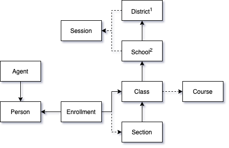

# School Data Model

Our school data model enforces a strict set of rules for how objects in our database connect and relate to one another.

## Diagram

Arrows point in the direction of reference. For example, the **[School](../../api/v2.0/models/external/school)** has a reference to the parent **[District](../../api/v2.0/models/external/district)**.

Solid lines indicate required references. A **[Section](../../api/v2.0/models/external/section)** must reference the **[Class](../../api/v2.0/models/external/class)** it belongs to. Note that not all references are shown here— for instance, a **[Person](../../api/v2.0/models/external/person)** always has a reference to their **[District](../../api/v2.0/models/external/district)**.

Dotted lines indicate optional references. All providers might not support certain features. For example, it's not guaranteed that a **[Class](../../api/v2.0/models/external/class)** will reference a **[Course](../../api/v2.0/models/external/course)**.

### Footnotes
1. There will always be exactly one **[District](../../api/v2.0/models/external/district)** in a source.
2. There will always be at least one **[School](../../api/v2.0/models/external/school)** in a source.
